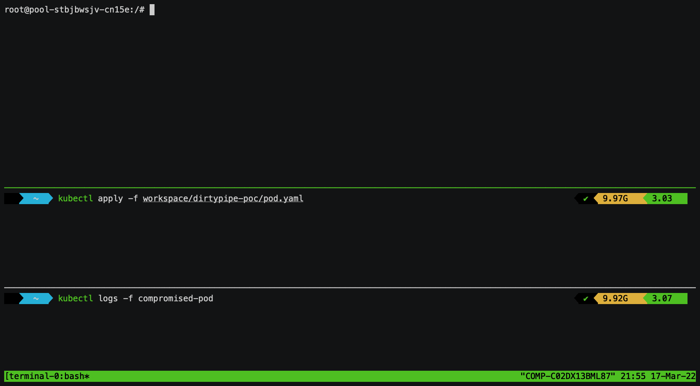

# Dirty Pipe Container Escape

This repository contains a proof of concept exploit leveraging the Dirty Pipe vulnerability (CVE-2022-0847) to break out from an underprivileged container.

Tested on a Kernel 5.10.0-0 with runc 1.0.2 on Kubernetes 1.22.7, but should work on any vulnerable kernel.

See also: [The Dirty Pipe vulnerability: Overview, detection, and remediation](https://www.datadoghq.com/blog/dirty-pipe-vulnerability-overview-and-remediation/).

## Demo

<p align="center">
  <a href="https://github.com/DataDog/dirtypipe-container-breakout-poc/raw/main/demo.gif">
    
  </a>
</p>


## Usage

1. Deploy the pod definition `pod.yaml` to a Kubernetes cluster. This simulates a pod having been compromised by an attacker. Note that the pod is underprivileged.

```
$ kubectl apply -f pod.yaml
pod/compromised-pod created
```

2. Execute `/bin/sh` in your compromised pod. This will trigger the exploit and overwrite the runc binary on the host, leading to a full host compromise.

```
$ kubectl exec -it compromised-pod -- sh
```

The payload used in the current exploit simply runs `id` and `hostname` and outputs the result to `/tmp/hacked`:

```
$ cat /tmp/hacked
uid=0(root) gid=0(root) groups=0(root)
pool-stbjbwsjv-cn15e
```

## Notes

This proof-of-concept requires the malicious script to run as root, in order to overwrite /bin/sh (or any binary that has a high chance of being executed through kubectl exec) with the necessary contents (`#!/proc/self/exe`). Note that we cannot use Dirty Pipe itself to overwrite a binary with this string, as Dirty Pipe doesn’t allow to overwrite the first byte of the target file. The first byte of a binary executable would remain 0x7f, the first magic byte of an ELF binary.

Breaking out from a container using an underprivileged user is left as an exercise to the reader, who is highly encouraged to contribute back to this repository. :-) 

## Credits

- Dirty Pipe original PoC: Max Kellermann (https://dirtypipe.cm4all.com/)
- Explotation of CVE-2019-5736 through overwrite of runc: Yuval Avrahami (https://unit42.paloaltonetworks.com/breaking-docker-via-runc-explaining-cve-2019-5736/)
